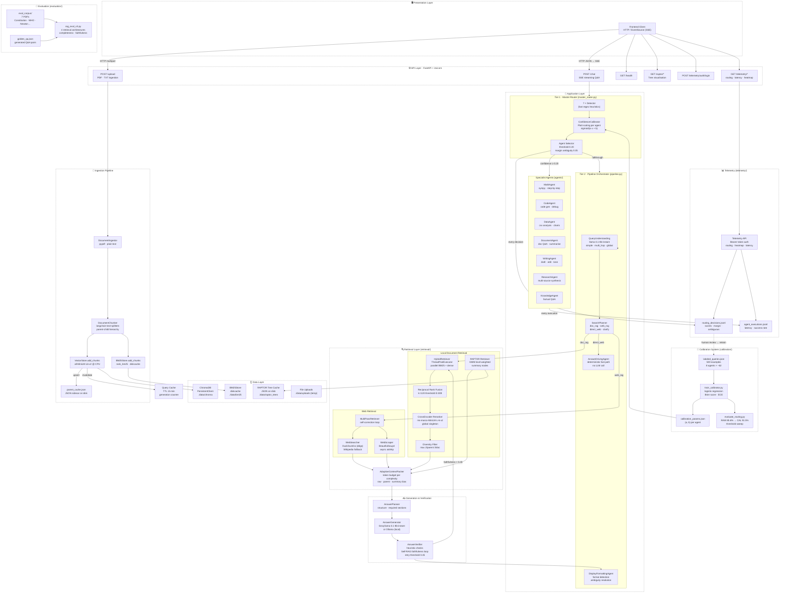

# DocuMind Backend

> A production-grade multi-agent RAG (Retrieval-Augmented Generation) system with calibrated routing, RAPTOR hierarchical retrieval, Self-RAG verification, and a full telemetry pipeline.

---

## Table of Contents

- [Overview](#overview)
- [System Architecture](#system-architecture)
- [Component Reference](#component-reference)
- [Data & Request Flow](#data--request-flow)
- [Technology Stack](#technology-stack)
- [Directory Structure](#directory-structure)
- [Setup & Running](#setup--running)
- [API Reference](#api-reference)
- [Calibration System](#calibration-system)
- [Retrieval Strategies](#retrieval-strategies)
- [Evaluation](#evaluation)
- [Key Design Decisions](#key-design-decisions)

---

## Overview

DocuMind is a document-grounded question-answering backend that routes every incoming query through a two-tier decision architecture:

1. **Tier 1 — Master Router**: 7 specialist agents compete via Platt-calibrated confidence scores. If any agent clears the selection threshold (0.20 calibrated probability), it takes the query exclusively.
2. **Tier 2 — Pipeline Orchestrator**: Queries that don't match a specialist fall through to the general RAG pipeline, which selects between `doc_rag`, `web_rag`, `direct_web`, or `clarify` modes based on query understanding and available context.

All answers stream as Server-Sent Events (SSE). The system is designed for single-GPU deployment (RTX 3050 4 GB), with the embedding model pinned to CPU and LLM inference handled by Groq (default) or a local Ollama server.

---

## System Architecture



---

## Component Reference

### API Layer (`api.py`)

| Endpoint | Method | Purpose |
|---|---|---|
| `/upload` | POST | Ingest PDF or TXT; indexes into ChromaDB + BM25; invalidates query cache |
| `/chat` | POST | Main Q&A entry point; returns SSE stream |
| `/health` | GET | Liveness check — Groq key, vector store reachability, BM25 index |
| `/raptor/trees/{doc_id}` | GET | List cached RAPTOR trees for a document |
| `/raptor/tree/{doc_id}` | GET | Return full tree JSON |
| `/raptor/tree/{doc_id}/mermaid` | GET | Mermaid.js tree visualisation |
| `/raptor/tree/{doc_id}/dot` | GET | Graphviz DOT tree visualisation |
| `/telemetry/auth/login` | POST | Exchange password for Bearer token |
| `/telemetry/summary` | GET | Routing summary stats (protected) |
| `/telemetry/routing/timeseries` | GET | Routing decisions over time (protected) |
| `/telemetry/routing/confidence_distribution` | GET | Score histograms (protected) |
| `/telemetry/routing/score_heatmap` | GET | Agent score heatmap (protected) |
| `/telemetry/agents/latency` | GET | Per-agent latency stats (protected) |
| `/telemetry/agents/error_rate` | GET | Per-agent error rates (protected) |

### Master Router (`agents/master_router.py`)

The core routing decision engine. On every query:

1. Runs all 7 detectors **synchronously** (they are pure regex/heuristics, < 1 ms each).
2. Passes raw scores to `ConfidenceCalibrator` → calibrated probability per agent.
3. Iterates `priority_order = [math, code, data, document, writing, research, knowledge]` to select winner.
4. Applies two ambiguity signals:
   - **Absolute band** (0.50–0.70): winner's own calibrated score is in the uncertain range.
   - **Margin signal** (< 0.05): winner beat runner-up by less than the margin threshold — routing was decided by priority order, not by a genuine score gap.
5. Returns `routing_result` with winner, all scores, runner-up, margin, and `ambiguous` flag.
6. Logs every decision to `telemetry/data/telemetry/routing_decisions.jsonl`.

**Selection threshold: 0.20** — tuned on the labeled dataset. A calibrated probability of 0.20 means this agent is the best available match relative to competitors, even if it's not highly confident in absolute terms.

### Agent Base Class (`agents/agent_base.py`)

All specialist agents implement the **Observe → Plan → Act → Reflect** loop:

```
OBSERVE   Read query + context + prior steps
  ↓
PLAN      Decompose into sub-tasks; choose tools
  ↓
ACT       Execute one tool call (LLM · retriever · sympy · search …)
  ↓
REFLECT   Evaluate result; stop / retry / escalate
```

Hard caps: `MAX_STEPS = 4`, `CONFIDENCE_THRESHOLD = 0.6`. All agents emit SSE events during execution (`{agent}_thinking`, `{agent}_step`, `{agent}_reflection`, `final`), providing a full step trace in the response payload.

### Pipeline Orchestrator (`pipeline.py`)

Handles queries that don't match a specialist. The execution sequence:

| Step | Component | Notes |
|---|---|---|
| 0 | `ConversationContext` | Resolve entity references from history |
| 0.5 | `DisplayFormattingAgent` | Detect output format + ambiguity |
| 1 | `QueryUnderstandingEngine` | LLM intent + 3-way complexity classification |
| 2 | `SearchPlanner` | Select mode: `doc_rag / web_rag / direct_web / clarify` |
| 3 | Cache check | TTL (15 min) + corpus-generation aware |
| 4 | Retrieval | Local doc search or multi-pass web search |
| 5 | `AdaptiveContextPacker` | Token budget by complexity |
| 6 | `AnswerGenerator` | Groq / Ollama streaming |
| 7 | `AnswerVerifier` | Heuristic checks + Self-RAG faithfulness loop |
| 8 | `DisplayFormattingAgent` | Apply display format to verified answer |
| 9 | SSE `final` event | With interpretation metadata |

**Query cache**: keyed on normalised query string. Each entry is `(event, cached_at_ts, corpus_generation)`. Calling `invalidate_cache()` bumps `_corpus_generation`, making all existing entries stale on the next lookup — O(1) invalidation without walking every cache key.

### Retrieval Stack (`retrieval/`)

Four retrieval strategies are available, selectable by complexity signal or eval configuration:

| Strategy | Class | When used |
|---|---|---|
| Naive dense | `VectorStore.search` | Baseline; `simple` queries |
| Hybrid RRF | `HybridRetriever` | Default; `multi_hop` queries |
| Routed hybrid | Gated by `QueryRouter` | `bm25 / dense / hybrid` per query features |
| RAPTOR | `RaptorRetriever` | `global` queries; summary-node weighted retrieval |

The live `HybridRetriever` pipeline:
1. **Query variant expansion** — up to 4 lexical/semantic variants for broader coverage.
2. **Parallel retrieval** — `ThreadPoolExecutor` runs BM25 and dense search concurrently.
3. **Weighted RRF** — fuses ranked lists with `k=120`, drops below `threshold=0.009`.
4. **CrossEncoder reranking** — `ms-marco-MiniLM-L-6-v2` as a global singleton (loaded once per process).
5. **Diversity filter** — max 2 chunks per parent, 3 per document.
6. **Parent context expansion** — child chunks are returned with their parent's text as `context_text`, giving the generator broader passage context while keeping citation metadata precise.

### RAPTOR (`retrieval/raptor.py`)

Builds a recursive abstraction tree over a document's chunks:

- **Level 0**: raw child chunks (from `DocumentChunker`).
- **Level 1+**: groups of lower-level chunks clustered by a **Gaussian Mixture Model** (BIC-selected number of components), each group summarised by Ollama.
- **Soft assignment** (threshold 0.15): a chunk genuinely relevant to two clusters is included in both, unlike k-means hard assignment.
- Summary nodes are written back into ChromaDB + BM25 with `node_type: "summary"` and `raptor_level: N` metadata, making them searchable through the same retrieval path without any API changes.
- Global/abstractive queries preferentially retrieve summary nodes; factual queries prefer raw chunks.

### Self-RAG Faithfulness Loop (`answer/answer_verifier.py`)

After each generation, the verifier:

1. Scores how well the answer is grounded in the retrieved context, using `llama-3.1-8b-instant` as a judge.
2. If the faithfulness score is below **0.45**, it fires the optional `retriever` callback to fetch fresh context with an expanded/rewritten query, then regenerates and scores again.
3. Maximum **1 retry** before accepting the current answer.
4. Falls back to heuristic-only verification if no retriever/generator callbacks are available (backward-compatible).

### Calibration System (`calibration/`)

**Platt scaling** maps each detector's raw heuristic score to a comparable probability `P(this agent is the correct route)`:

```
calibrated_score = sigmoid(a × raw_score + b)
```

Per-agent `(a, b)` parameters are fit by logistic regression on `labeled_queries.json` (500 examples, ~62 per agent/class), stored in `calibration_params.json`, and loaded at startup by `ConfidenceCalibrator`.

| Agent | a | b | n_positive |
|---|---|---|---|
| math | 6.56 | -2.58 | 63 |
| code | 6.78 | -2.71 | 63 |
| writing | 6.56 | -3.06 | 63 |
| knowledge | 4.67 | -3.92 | 63 |
| data | 6.30 | -3.89 | 62 |
| document | 6.38 | -3.72 | 62 |
| research | 6.25 | -3.40 | 62 |

To retrain after adding new labeled examples:

```bash
python calibration/train_calibrator.py
python calibration/evaluate_routing.py
```

---

## Data & Request Flow

### Document Upload

```
Client  →  POST /upload (multipart)
        →  DocumentIngestor.parse_pdf / parse_txt
        →  DocumentChunker  (parent-child hierarchy)
        →  VectorStore.add_chunks  (encode with all-MiniLM-L6-v2 @ CPU → ChromaDB upsert)
        →  BM25Store.add_chunks    (rank_bm25 index → diskcache persist)
        →  parent_cache.json updated
        →  orchestrator.invalidate_cache()   ← bumps corpus_generation
        →  200 {"chunks_processed": N}
```

### Chat Query (doc_rag path)

```
Client  →  POST /chat {"query": "...", "mode": "auto"}
        →  SSE stream begins

ConversationContext.resolve_references()
DisplayFormattingAgent.resolve_and_detect()

MasterRouter.route()
  ├── All 7 detectors run (sync, < 5 ms total)
  ├── ConfidenceCalibrator.calibrate()
  └── If best_score ≥ 0.20  →  specialist agent  →  SSE events  →  DONE

Pipeline fallthrough:
  QueryUnderstandingEngine.understand()   [Groq: intent, complexity, rewrite]
  SearchPlanner.plan()                    [mode = doc_rag]
  Cache miss check
  HybridRetriever.retrieve()
    ├── Query variant expansion
    ├── Parallel BM25 + dense (ThreadPoolExecutor)
    ├── RRF fusion
    ├── CrossEncoder rerank
    └── Diversity filter + parent expansion
  AdaptiveContextPacker.pack()
  AnswerGenerator.generate_stream()       [Groq streaming → yield SSE tokens]
  AnswerVerifier.verify()
    ├── Self-RAG faithfulness score
    ├── (retry if < 0.45)
    └── Heuristic checks
  DisplayFormattingAgent.process()
  AgentTelemetry.log_routing_decision()

  →  SSE final event: {answer, sources, confidence, interpretation, ...}
```

---

## Technology Stack

| Layer | Technology | Version / Notes |
|---|---|---|
| **Web framework** | FastAPI | 0.111.0 |
| **ASGI server** | Uvicorn | 0.30.1 |
| **SSE streaming** | sse-starlette | 2.1.2 |
| **Validation** | Pydantic | 2.9.2 |
| **LLM inference (cloud)** | Groq API — `llama-3.1-8b-instant` | groq 0.9.0 |
| **LLM inference (local)** | Ollama — `llama3.2` default | ollama 0.6.2 |
| **Dense embeddings** | all-MiniLM-L6-v2 (CPU) | sentence-transformers 3.0.1 |
| **Cross-encoder reranker** | ms-marco-MiniLM-L-6-v2 | sentence-transformers |
| **Vector database** | ChromaDB PersistentClient | 0.5.0 |
| **Lexical search** | BM25Okapi | rank_bm25 0.2.2 |
| **BM25 persistence** | diskcache | 5.6.3 |
| **Text splitting** | LangChain text splitters | langchain-text-splitters 0.2.2 |
| **PDF parsing** | pypdf | 4.2.0 |
| **RAPTOR clustering** | scikit-learn GaussianMixture | ≥ 1.3.0 |
| **Web search** | DuckDuckGo (ddgs) + Wikipedia fallback | ddgs 9.14.4 |
| **Web scraping** | BeautifulSoup4 + aiohttp | bs4 4.12.3 / aiohttp 3.9.5 |
| **VLM / visual retrieval** | OpenCV + PyMuPDF + Pillow + OpenAI | cv2, fitz, PIL |
| **Async HTTP** | aiohttp | 3.9.5 |
| **Environment** | python-dotenv | 1.0.1 |
| **Auth** | Custom Bearer token (telemetry endpoints) | — |

---

## Directory Structure

```
backend/
├── api.py                         # FastAPI app, endpoint definitions
├── pipeline.py                    # PipelineOrchestrator (tier-2 RAG loop)
├── _path_setup.py                 # sys.path bootstrap for imports
├── requirements.txt
│
├── agents/                        # Multi-agent layer
│   ├── master_router.py           # Tier-1 routing engine + calibration wiring
│   ├── agent_base.py              # BaseAgent abstract class (Observe→Plan→Act→Reflect)
│   ├── agent_registry.py          # Registry of all 7 specialist agents
│   ├── router.py                  # QueryRouter (bm25 / dense / hybrid per query)
│   ├── math/                      # MathAgent + MathDetector + MathClassifier
│   ├── code/                      # CodeAgent + CodeDetector + CodeClassifier
│   ├── data/                      # DataAgent + DataDetector + DataAnalyst
│   ├── document/                  # DocumentAgent + DocumentDetector
│   ├── writing/                   # WritingAgent + WritingDetector
│   ├── research/                  # ResearchAgent + ResearchPlanner + Synthesizer
│   └── knowledge/                 # KnowledgeAgent + KnowledgeDetector
│
├── answer/                        # Generation pipeline
│   ├── answer_driving_agent.py    # Deterministic direct_web fast path
│   ├── answer_planner.py          # Answer structure planning
│   └── answer_verifier.py         # Self-RAG faithfulness loop + heuristic checks
│
├── calibration/                   # Routing calibration system
│   ├── labeled_queries.json       # 500 hand-labeled (query, gold_agent) examples
│   ├── train_calibrator.py        # Fit Platt scaling (a, b) per agent
│   ├── calibration_params.json    # Fitted parameters (loaded at runtime)
│   ├── evaluate_routing.py        # Accuracy report + threshold sweep
│   ├── benchmark_detectors.py     # Baseline comparisons
│   └── baseline_classifiers.py    # TF-IDF / keyword baselines
│
├── core/                          # Shared infrastructure
│   ├── generator.py               # AnswerGenerator (Groq / Ollama, streaming)
│   ├── query_understanding.py     # QueryUnderstandingEngine (intent, complexity)
│   ├── display_agent.py           # DisplayFormattingAgent
│   ├── context_packer.py          # AdaptiveContextPacker (token budgeting)
│   ├── conversation_context.py    # Entity resolution across turns
│   ├── domain_patterns.py         # Shared regex patterns (negation, legal, technical)
│   ├── ingestion.py               # DocumentIngestor (PDF, TXT)
│   ├── metrics.py                 # Evaluation metrics
│   └── logger.py                  # Logging setup
│
├── retrieval/                     # Retrieval stack
│   ├── retriever.py               # HybridRetriever (parallel BM25+dense, RRF, rerank)
│   ├── vector_store.py            # VectorStore (ChromaDB + parent cache)
│   ├── bm25_store.py              # BM25Store (rank_bm25 + diskcache)
│   ├── raptor.py                  # RAPTOR tree builder (GMM clustering + Ollama summaries)
│   ├── chunking.py                # DocumentChunker (parent-child hierarchy)
│   ├── context_packer.py          # AdaptiveContextPacker
│   ├── reranker.py                # CrossEncoder wrapper
│   ├── evidence_ranker.py         # Evidence scoring
│   ├── search_planner.py          # SearchPlanner (mode selection)
│   ├── self_correction.py         # MultiPassRetriever (web)
│   ├── retrieval_memory.py        # Per-query retrieval scratchpad
│   ├── source_selector.py         # Source quality filtering
│   └── vlm_retriever.py           # Visual-language retrieval (MaxSim style)
│
├── telemetry/                     # Observability
│   ├── agent_telemetry.py         # Routing + execution logging (JSONL)
│   ├── confidence_calibrator.py   # Runtime calibrator (alias)
│   ├── telemetry_api.py           # Protected REST endpoints
│   └── telemetry_auth.py          # Bearer token authentication
│
├── web/                           # Web retrieval
│   ├── web_search.py              # DuckDuckGo + Wikipedia fallback
│   └── web_scraper.py             # Async BeautifulSoup scraper
│
├── evaluation/                    # Offline evaluation
│   ├── rag_eval_v3.py             # 4-architecture evaluation harness
│   ├── eval_golden_qa.json        # Generated golden Q&A pairs
│   ├── generate_golden_qa.py      # Golden set generation script
│   ├── evaluate.py                # Core evaluation runner
│   └── eval_results_v3.json       # Latest results
│
├── tests/                         # Test suite
│   ├── test.py                    # Main test file
│   ├── test_routing.py            # Routing unit tests
│   └── test_runner.py             # Test harness
│
├── eval_corpus/                   # Evaluation documents
│   ├── us_constitution.pdf
│   ├── who_physical_activity.pdf
│   ├── attention_paper.pdf        # "Attention is All You Need"
│   ├── think_python.pdf
│   ├── newton_principia.pdf
│   ├── rfc9112_http.pdf
│   └── art_of_war.pdf
│
└── data/                          # Runtime data (gitignored)
    ├── chroma/                    # ChromaDB persisted collections
    ├── bm25/                      # BM25 diskcache
    ├── raptor_trees/              # RAPTOR JSON caches
    ├── uploads/                   # Temporary upload staging
    └── telemetry/                 # JSONL telemetry logs
```

---

## Setup & Running

### Prerequisites

- Python 3.11+
- A **Groq API key** (free tier sufficient for development): set `GROQ_API_KEY` in `.env`
- *(Optional)* [Ollama](https://ollama.com/) for fully local inference: set `OLLAMA_MODEL=llama3.2`

### Install

```bash
cd backend
pip install -r requirements.txt
```

### Environment

```bash
cp .env.example .env
# Edit .env:
GROQ_API_KEY=gsk_...
# Optional local inference:
# OLLAMA_MODEL=llama3.2
# OLLAMA_BASE_URL=http://localhost:11434
# OLLAMA_NUM_CTX=2048
```

### Run

```bash
uvicorn api:app --reload --host 0.0.0.0 --port 8000
```

### Calibration (first time or after adding labeled data)

```bash
python calibration/train_calibrator.py
python calibration/evaluate_routing.py
```

### Evaluation

```bash
python evaluation/rag_eval_v3.py
```

---

## API Reference

### POST `/upload`

```json
// multipart/form-data
{
  "file": "<binary PDF or TXT>"
}

// Response
{
  "message": "Document ingested successfully",
  "chunks_processed": 142,
  "doc_id": "my_document.pdf"
}
```

### POST `/chat`

```json
// Request
{
  "query": "What is the maximum sentence length for sedition?",
  "mode": "auto"   // "auto" | "doc" | "web"
}

// SSE stream — intermediate events
event: pipeline_thinking
data: {"status": "retrieving", "agent": "pipeline"}

// SSE stream — final event
event: final
data: {
  "mode": "doc_rag",
  "answer": "...",
  "sources": [{"chunk_id": "...", "text": "...", "score": 0.82}],
  "confidence": "high",
  "needs_clarification": false,
  "interpretation": {
    "intent": "factual",
    "rewritten_query": "maximum sentence sedition",
    "mode": "doc_rag"
  },
  "routed_agent": null,
  "uncertainty_flag": false,
  "margin_ambiguous_flag": false
}
```

**Mode overrides:**
- `"doc"` — forces `doc_rag`, bypasses master router.
- `"web"` — forces `web_rag`, bypasses master router.
- `"auto"` — full routing logic applies.

---

## Calibration System

The calibration pipeline closes the loop between live routing decisions and the Platt-scaling parameters used by `ConfidenceCalibrator`:

```
Live queries
    ↓
routing_decisions.jsonl   ← AgentTelemetry logs every decision
    ↓
Human review (filter "ambiguous": true entries first)
    ↓
labeled_queries.json      ← Add gold_agent labels for reviewed entries
    ↓
train_calibrator.py       ← Fit sigmoid(a·x + b) per agent via logistic regression
    ↓
calibration_params.json   ← Written to disk
    ↓
ConfidenceCalibrator      ← Loads at startup (or call .reload() for hot-reload)
```

**Metrics reported by `train_calibrator.py`:**
- Per-agent **Brier score** (lower = better calibration)
- Per-agent **ECE** (Expected Calibration Error)
- Before vs. after comparison

**Current accuracy** (on the 500-example labeled set):
- Raw scores @ threshold 0.50: **85.6%**
- Calibrated scores @ threshold 0.20: **91.5%**

> ⚠️ **Known limitation**: calibration parameters are currently fit on the full 500-example dataset with no train/test split. This means the 91.5% accuracy number is evaluated in-sample and may be optimistic. A proper cross-validated estimate with a held-out test split is the next remediation step.

---

## Retrieval Strategies

The four strategies evaluated in `rag_eval_v3.py`, in order of complexity:

| # | Strategy | Architecture | Best for |
|---|---|---|---|
| 1 | **Naive Dense** | Single-stage VectorStore search | Simple factual lookups |
| 2 | **Hybrid RRF** | Parallel BM25 + dense → Reciprocal Rank Fusion | General Q&A |
| 3 | **Routed Hybrid** | QueryRouter → BM25 / dense / hybrid per query | Mixed lexical/semantic queries |
| 4 | **RAPTOR** | GMM tree + level-weighted summary retrieval | Global / abstractive questions |

Key retrieval parameters:

```python
RRF_K = 120                    # Flatten BM25 dominance for common tokens
RRF_SCORE_THRESHOLD = 0.009    # Drop chunks only in one list at poor rank
MAX_QUERY_VARIANTS = 4         # Expansion variants for broader coverage
SUMMARY_FUSION_WEIGHT = 0.35   # Weight for RAPTOR summary nodes in RRF
SUMMARY_RESERVE_K = 3          # Slots reserved for summary nodes in final top-k
```

---

## Evaluation

The evaluation harness (`evaluation/rag_eval_v3.py`) benchmarks all four retrieval strategies across 7 documents from `eval_corpus/`, measuring:

- **Completeness** — fraction of answer content supported by retrieved chunks
- **Faithfulness** — hallucination rate (answer claims not in context)
- **Retrieval precision** — fraction of retrieved chunks relevant to the query
- **Latency** — end-to-end time per query

Golden Q&A pairs are generated per document by `generate_golden_qa.py` using Groq and stored in `eval_golden_qa.json`.

---

## Key Design Decisions

**Why Platt scaling over raw detector scores?**
Each detector uses a different number of contributing signals with different base offsets — a 0.7 from `MathDetector` and a 0.7 from `WritingDetector` are not the same thing. Platt scaling fits a per-agent affine transform in logit space so calibrated scores are directly comparable across agents. This improved routing accuracy by 5.9 percentage points (85.6% → 91.5%) on the labeled set.

**Why a 0.20 calibrated threshold instead of 0.50?**
A calibrated probability of 0.50 means "more likely wrong than right in isolation." But routing only needs "best among competitors." Because some detectors (especially `KnowledgeDetector`) produce high raw scores for both true positives and false positives, their calibrated probabilities cluster below 0.50 even when they're the clear best match. 0.20 was selected by threshold sweep on the labeled dataset.

**Why a generation counter for cache invalidation?**
Walking all cache keys on every upload is O(N) and requires a lock. Bumping a single integer (`_corpus_generation`) is O(1) and lock-free. Existing entries with a stale generation are lazily evicted on first access.

**Why parent-child chunking?**
Child chunks (small, ~200 tokens) are precise enough to score well in retrieval. But they lack sufficient context for generation. Returning the child's parent text (`context_text`) to the generator gives it a broader passage window while keeping citation metadata pointing at the exact matched chunk.

**Why GMM over k-means for RAPTOR?**
k-means forces hard cluster assignment — a chunk genuinely relevant to two topics gets assigned to only one. GMM with soft assignment (threshold 0.15) allows a chunk to participate in multiple clusters, so its content reaches multiple summary nodes at higher tree levels. This is exactly what the original RAPTOR paper proposes and matters most for documents that span multiple topics.

**Why a global CrossEncoder singleton?**
The eval loop creates a fresh `HybridRetriever` instance per document. Without the module-level singleton, each instance would re-load the ~130 MB cross-encoder weights, wasting memory and adding seconds of startup latency per document.

**Why DuckDuckGo + Wikipedia fallback?**
DuckDuckGo requires no API key and has no rate limits for moderate usage. Wikipedia is a structured, high-quality fallback for factual queries that fail on the open web. Both are accessed asynchronously via `asyncio.to_thread` to avoid blocking the event loop.
